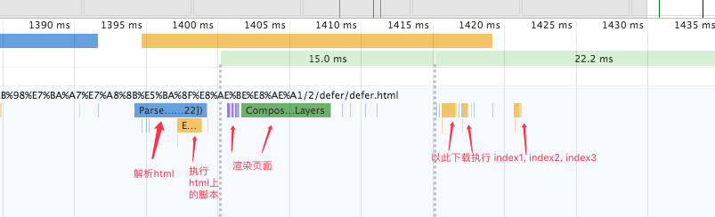
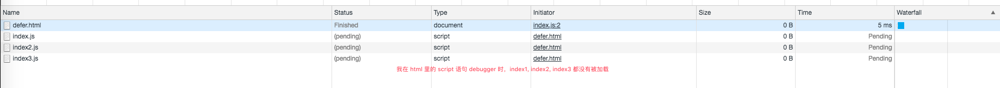
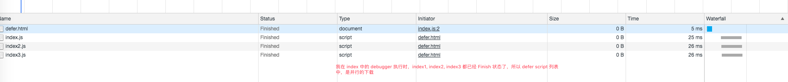
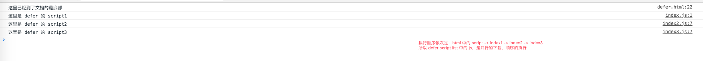

## 在 HTML 中使用 javascript

### defer

表示脚本可以延迟到文档完全被解析和显示之后再执行。只对外部脚本文件有效

详情看 ./defer/defer.html

可以把浏览器对于 defer 修饰的元素想象成一个数组
解析到第一个带有 defer 的 script1，向这个数组里 push 当前的 script，并且将 script1 设置为 pending 状态
以此类推 script2, script3
然后当且仅当浏览器解析完了所有的 html，再去将那个数组，从头开始，下载时同步并行下载 index1, index2, index3, 执行时依次执行 index1, index2, index3

##### 页面 html 执行完后再执行 index1, index2, index3
 

##### html 解析执行的时候，会把所有 defer script 设置为 pendding

##### html 执行结束，defer script 并行下载

##### 下载完毕，顺序执行

