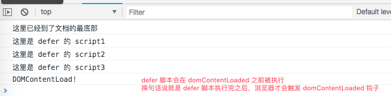
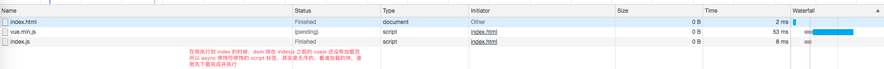

## 在 HTML 中使用 javascript

### 1. defer

表示脚本可以延迟到文档完全被解析和显示之后再执行。只对外部脚本文件有效

详情看 ./defer/defer.html

可以把浏览器对于 defer 修饰的元素想象成一个数组
解析到第一个带有 defer 的 script1，向这个数组里 push 当前的 script，并且将 script1 设置为 pending 状态
以此类推 script2, script3
然后当且仅当浏览器解析完了所有的 html，再去将那个数组，从头开始，下载时同步并行下载 index1, index2, index3, 执行时依次执行 index1, index2, index3


##### 页面 html 执行完后再执行 index1, index2, index3
 


##### html 解析执行的时候，会把所有 defer script 设置为 pendding


##### html 执行结束，defer script 并行下载


##### 下载完毕，顺序执行


##### 执行时机是在 DOMContentLoaded 钩子触发之前



### async

demo 可以异步 ./async/index.html

async 和 defer 一样，也是可以让 script 标签不阻塞执行

但是 defer 给人的感觉是可以抽象成一个序列，排在 html 解析完成之后，一个一个的有顺序执行

但是 async 给人的感觉，就是解析到一个 async 的script 之后，浏览器就开始下载这个 js，下载完就自己执行，不会说一个一个挨着的执行，不能像 defer 一样保证顺序

加入第一个 async 的是一个很大的 js，第二个是一个很小的 js，那也会是第二个先下载完成，然后先执行，而后才会是稍大点的 js 去执行



### script 引入外部 js

如果说我们一个 script 标签这样写：

```html
<script src="./defer/index.js">
    console.log(123456)
</script>
```

这时候浏览器只会去加载 ./defer/index.js 并执行，会直接忽略掉 script 标签内部的那条打印

无论包含不包含代码，只要不存在 defer 和 async 属性，浏览器执行这个 script 标签的时候就会停下来下载并解析，解析执行完后才会去解析后面的代码

### script 标签的位置

我们有一条规范，是将样式都放在 `<head>` 中，而把 script 标签都放在 `<body>` 的最底下

试想下我们如果不这样做，假设我们在 `head` 中引入了一个很大很大的js，花费时间为 3s，则这三秒的时间内，html 的解析一直停在 head 部分，而呈现给用户的是 `body` 标签里的内容，用户在这三秒里其实一直都在看的是白屏，用户体验极差

