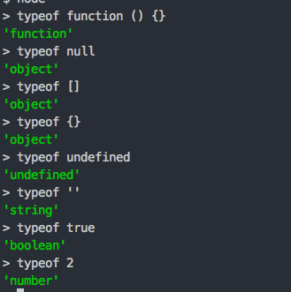
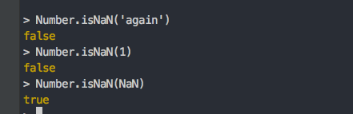

## 基本概念

### 1. 标识符

标识符就是指变量，函数，对象属性的名字，或者函数的参数

第一个字符必须是字母或下划线(_)或美元符号($)，后续的字符可以使数字字母下划线和美元符

标识符最好为首字母小写的驼峰形式，但是标识符用作构造函数的名字的时候，推荐驼峰形式且首字母大写

### 2. 变量

js 的变量是松散类型，也就是说，可以保存任何类型的数据 => 每个变量只是一个用来保存值的占位符

定义变量的语法就是，`var` 操作符后面跟一个标识符，比如：

```js
var message;
```

用 var 操作符定义的变量，将成为定义该变量的作用域中的局部变量

如果在一个函数中定义一个变量，那么这个变量在函数退出后就会被销毁 => 具体可以看 ./2/varible-scope.js

如果我们在一个作用域中，不使用 `var` 操作符去声明变量。那么就会导致这个变量被声明到了全局作用域中 => demo 可以看 ./2/declare-varible-without-var.js

### 3. 数据类型

js 有五种简单数据类型，Undefined, Null, Boolean, Number, String, 还有一种复杂类型，Object

typeof 操作符可以大致上区分这些数据类型，当然，只是大致上，因为 typeof 操作符会返回一些令人迷惑但技术上却正确的值



特殊值 null 被人理解为一个空对象的引用，所以返回了 object

数组也是一个特殊的对象

至于 function 为什么 typeof 操作符返回 `function`, 则是因为文档上区分了对象内部是否实现了 `[[call]]`


其中需要注意的是。原生 Object 且内部没有实现 `[[call]]` 的话，typeof 后会返回 `object`

而原生对象或者宿主对象内部实现了 `[[call]]` ，则会返回 `function`

这里的 `[[call]]`, 在对象区分方面起到的主要作用，内部实现了 `[[call]]` 的对象，才能够被当做函数去调用 [扩展链接](http://bubkoo.com/2014/06/22/ecma-262-3-in-detail-chapter-7-2-oop-ecmascript-implementation/)

### 3. Undefined 类型

这个类型下，只有一个值，即 `undefined`

在使用 `var` 声明变量但是未对其进行初始化的时候，这个变量的值就是 `undefined`

demo 可以看 ./3/undefined.js

这里要和 undeclared 变量作区分，`undefined` 的值，是声明了，但是没有初始化它的值，而 `undeclared` 则是根本就没有声明这个值，后面想要引用它的时候，很可能会报错

这里只是说的很可能，意思就是绝大多数情况下都会报 `xxx is not defined`, 而在一些特殊情况下，比如 `typeof` 操作符的时候，就不会报错了。。这里返回会返回 `undefined`


而我们对 `undeclared` 变量和 `undefined` 变量做区分的话，现在 js 其实是没有提供区分的途径的，只能通过我们平时的写法来规避

比如我们每次在初始化变量的时候，都显式的给他赋值，这样一来我们在代码中用 `typeof` 判断出来为 `undefined` 的时候，那个变量则一定是 `undeclared` 变量

### 4. Null 类型

Null 类型与 Undefined 类型一样，也是类型下只有一个值，这个值就是 `null`

`null` 值表示一个空对象指针，这也正是我们前面说过的 `typeof null` 返回 `object` 的原因

如果我们声明一个变量，这个变量今后要保存对象的话，我们最好将其初始化为 `null`, 这样在语义上来看比较合适，二是在某个步骤上我们检测这个变量是否已经有了对象的引用的时候，只需要检测是否为 `null` 就好了

```js
let objInFuture = null

// some code...

if (objInFuture === null) {
    // some code...
}
```

实际上我们刚才说到的 `undefined` 是派生自 `null`, 所以 js 规定的 `undefined` 与 `null` 不严格相等，即 `undefined == null` 结果为 `true` 永远成立

尽管 `null` 和 `undefined` 这么相似，但是用法完全不同。我们永远不需要去显式的将一个变量设置为 `undefined`, 而当一个变量未来用于存储 `object` 而当前只是要初始化而没有填充 `object` 的时候，我们就应该将其设置为 `null`

### 5. Boolean 类型

Boolean 类型下有两个值，一个是 `true`, 一个是 `false`

这两个值是区分大小写的，所以 `True` 和 `False` 其实不是 Boolean 类型的值，而是标识符

想要将一个值转化为 Boolean 类型，只需要调用 Boolean 类型的包装函数：

```js
let varibleWantedToBeBoolean = 'Amnhh'
let booleanVarible = Boolean(varibleWantedToBeBoolean)
```

这两行代码里，我们先声明了一个变量，并且初始化为字符串，后面使用 `Boolean()` 函数，将这个值转化为 Boolean 类型, 并存储到另一个变量中

Boolean 值一般用于流程控制语句中，例如：

```js
if (true) {
    console.log('Here comes true')
} else {
    console.log('Here comes false')
}
```

### 6. NaN

NaN 是数字， `typeof` 后也会返回 `number`，他的最特殊的性质，就是它与自身都不相等：

```js
// false
console.log(NaN === NaN)
```

js 提供 `isNaN` 方法去检测 NaN，但是这个方法不能够很准确的检测出到底是不是 NaN，比如：

```js
// true
isNaN('again');
```

`isNaN` 这个函数在入参值不可以转化成数字的时候，也会抛出 true, 不管当前的值是不是绝对等于 NaN

而新的 js 规范中为 Number 构造函数新添了一个私有方法，叫做 `Number.isNaN`, 这个方法可以用来判断是不是绝对等于 NaN



