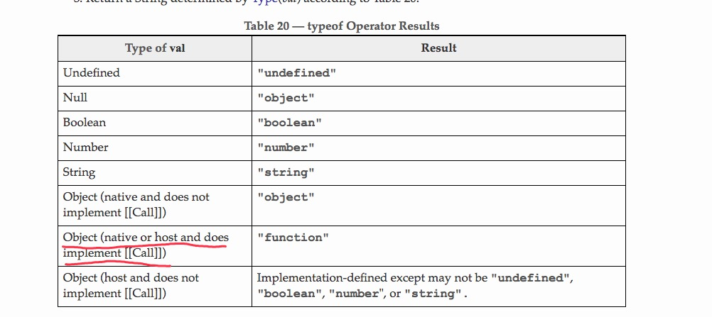

## 基本概念

### 1. 标识符

标识符就是指变量，函数，对象属性的名字，或者函数的参数

第一个字符必须是字母或下划线(_)或美元符号($)，后续的字符可以使数字字母下划线和美元符

标识符最好为首字母小写的驼峰形式，但是标识符用作构造函数的名字的时候，推荐驼峰形式且首字母大写

### 2. 变量

js 的变量是松散类型，也就是说，可以保存任何类型的数据 => 每个变量只是一个用来保存值的占位符

定义变量的语法就是，`var` 操作符后面跟一个标识符，比如：

```js
var message;
```

用 var 操作符定义的变量，将成为定义该变量的作用域中的局部变量

如果在一个函数中定义一个变量，那么这个变量在函数退出后就会被销毁 => 具体可以看 ./2/varible-scope.js

如果我们在一个作用域中，不使用 `var` 操作符去声明变量。那么就会导致这个变量被声明到了全局作用域中 => demo 可以看 ./2/declare-varible-without-var.js

### 3. 数据类型

js 有五种简单数据类型，Undefined, Null, Boolean, Number, String, 还有一种复杂类型，Object

typeof 操作符可以大致上区分这些数据类型，当然，只是大致上，因为 typeof 操作符会返回一些令人迷惑但技术上却正确的值


特殊值 null 被人理解为一个空对象的引用，所以返回了 object

数组也是一个特殊的对象

至于 function 为什么 typeof 操作符返回 `function`, 则是因为文档上区分了对象内部是否实现了 `[[call]]`



其中需要注意的是。原生 Object 且内部没有实现 `[[call]]` 的话，typeof 后会返回 `object`

而原生对象或者宿主对象内部实现了 `[[call]]` ，则会返回 `function`

这里的 `[[call]]`, 在对象区分方面起到的主要作用，内部实现了 `[[call]]` 的对象，才能够被当做函数去调用 [扩展链接](http://bubkoo.com/2014/06/22/ecma-262-3-in-detail-chapter-7-2-oop-ecmascript-implementation/)


